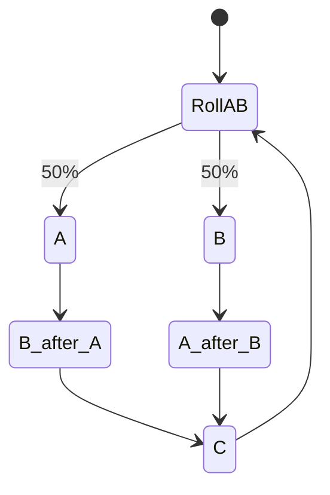
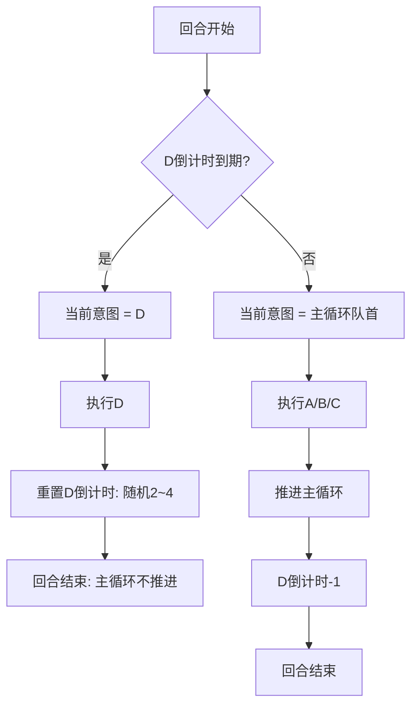
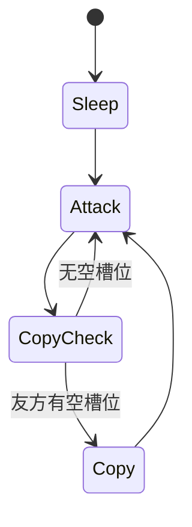

# GDD — 敌人设计

> 最后更新：2026-05-31
> 状态标注：✅ 已实现 / 🚧 部分实现 / ⬜ 待实现

## AI 架构

尖塔式意图轮转（IntentAI）。敌人没有费用概念——放随从、攻击、防御、强化都通过意图系统实现。

核心原则：**意图归属于 actor，而不是全局敌方阵营**。

- 敌方英雄是 actor：邪教徒、史莱姆首领、张郎、珊胡等。
- 敌方随从也是 actor：软泥怪、机械小蠊等。
- 当前 `EnemyMinionsAttack()` 的自动攻击规则应被收束为默认随从意图：`DefaultAttackMinionBrain`，即“攻击随机合法敌方目标”。
- 敌方英雄和敌方随从的攻击意图都必须尊重嘲讽，且意图显示与实际执行必须锁定同一个目标。

参考：杀戮尖塔2 `KaiserCrabBoss` 使用两个完整 Monster（`Crusher` / `Rocket`）组成 Boss 战，每个 Monster 各自拥有 HP、状态机和意图；协同通过 Power/事件实现，而不是共享血条包装。项目笔记见 `docs/notepads/sts2-kaiser-crab-intent-architecture-2026-05-31.md`。

## ✅ 已实现敌人

| 敌人 | HP | 武器 | 意图模式 |
|------|-----|------|----------|
| 邪教徒 (Cultist) | 20 | 棍木 (ATK 1) | Attack(6) → Attack(6) → Defend(5) |
| 史莱姆首领 (SlimeBoss) | 40 | 棍木 (ATK 1) | Attack(8) → Summon(1) → Defend(4)，召唤 1/1 软泥怪 |
| 狼骑兵 (WolfRider) | 12 | 棍木 (ATK 1) | Attack(5)，每回合稳定输出 |
| 守护者 (GuardianBoss) | 60 | 棍木 (ATK 1) | Attack(12) → Defend(8) → Attack(12) → 循环 |

## /fight 命令

`DevConsole` 支持 `/fight <enemy>` 直接开启战斗（绕过 Roguelike 地图）。

| ID | 战斗内容 |
|----|---------|
| `cultist` | 邪教徒（单） |
| `slimy` | 史莱姆首领（单） |
| `wolf` | 狼骑兵（单） |
| `guardian` | 守护者 Boss（单） |
| `zhanglang` | 张郎（单） |
| `shanhu` | 珊胡（单） |
| `zhangshan` | 张郎 + 珊胡（双敌人精英战） |

## ⬜ 待实现：双敌人系统

### 总体规则

- 张郎与珊胡同时登场，分别拥有独立 HP、武器、被动、状态和意图。
- 玩家需要击败两者才算胜利。
- 双敌人意图分别显示，敌人 UI 控件分别显示。
- 不做共享血条包装。
- 敌方随从与敌方英雄共用敌方 5 个棋盘槽位/目标集合，但随从自身也有意图。

### 张郎

| 属性 | 值 |
|------|-----|
| HP | 20 |
| 武器 | 棍木 |
| 被动技能 | **固璋（3）** — 单次受到的生命伤害最高为 3 |

意图：

| 编号 | 效果 |
|------|------|
| A | 造成随机 3~4 点基础伤害 |
| B | 造成 1 点伤害 ×3 |
| C | 使自身武器攻击力提高 1 |
| D | 每隔随机 2~4 个回合，召唤随从「机械小蠊」 |

主循环：A/B 随机交换顺序，然后 C，再回到 A/B 随机交换。

D 是**替代意图**：D 倒计时到期时，本回合只显示并执行 D，主循环指针不推进；D 执行后重置倒计时为随机 2~4。

### 珊胡

| 属性 | 值 |
|------|-----|
| HP | 20 |
| 武器 | 棍木 |
| 被动技能 | **不破（1）** — 每回合只能受到 1 次生命伤害；0 点生命伤害不计入次数 |

意图：

| 编号 | 效果 |
|------|------|
| A | 造成随机 3~4 点基础伤害 |
| B | 造成 2 点伤害 ×2 |
| C | 使自身武器攻击力提高 2 |
| D | 每隔随机 2~4 个回合，使一个随机友方目标获得 5 点护甲 |

主循环与 D 替代规则同张郎。

### 机械小蠊

| 属性 | 值 |
|------|-----|
| 类型 | 衍生随从（稀有度 0） |
| 费用 | 0 |
| 行动花费 | 1 |
| 身材 | 1 攻 / 3 血 / 0 防 |

意图：

| 编号 | 效果 |
|------|------|
| A | 部署回合：沉睡 |
| B | 攻击随机敌方目标 |
| C | 若友方有空槽位，在友方棋盘槽位加入一个自身的复制 |

循环：`A → B → C → B → C...`。若 C 条件不满足，则跳回 B。

“随机敌方目标”使用现有 `TargetTags` 目标集合设计：目标包括敌方英雄与敌方随从；若敌方存在嘲讽随从，则必须优先从嘲讽随从中随机选择。

## 意图状态图

### 主循环（A/B 随机交换 + C）



### D 替代调度器



### 机械小蠊



## 实现方向

### Intent Actor

推荐长期接口方向：

```csharp
public interface IIntentActor
{
    EnemyIntent GetCurrentIntent(CombatManager combat);
    void ExecuteIntent(CombatManager combat);
    void AdvanceIntent();
}
```

短期落点：

- `EnemyUnit`：包装 `Hero Body + EnemyEncounter/IntentBrain`。
- `MinionIntentActor`：包装 `Minion Body + MinionIntentBrain`。
- `DefaultAttackMinionBrain`：现有敌方随从攻击逻辑的显式化占位。
- `MechanicalRoachBrain`：睡眠 → 攻击/复制循环。

### TargetTags 目标选择

现有目标标签系统支持英雄/随从统一选择：

- `Hero.GetTargetTags()`：`Friendly/Enemy + Hero`
- `Minion.GetTargetTags()`：`Friendly/Enemy + Minion`
- `CardData.TargetFilter` / `ExcludeFilter`：表达必须包含与排除集合
- `TargetTagsHelper.IsValidTarget()`：执行子集/排除匹配

敌方随从“随机敌方目标”应复用同一语义：构造候选目标集合时同时加入英雄与随从，再用嘲讽规则收窄。

### 被动结算

#### 固璋（3）

作为目标侧 `IDamageModifier` 实现，进入 `DamagePhase.CAPPING`：

- 防御力等 ADDITIVE 阶段先计算。
- 易伤/虚弱等 MULTIPLICATIVE 阶段再计算。
- 固璋在 CAPPING 阶段将单次生命伤害上限压到 3。
- 护甲吸收仍发生在 `Hero.TakeDamage()` 内、DamageResolver 之后。

#### 不破（1）

不破需要每回合状态，因此不应做成纯无状态 modifier。

推荐语义：

1. 本回合第一次造成 `> 0` 生命伤害时，正常结算并标记“已受伤”。
2. 本回合之后再受到伤害时，伤害归 0。
3. 护甲吸收后若没有造成生命伤害（0 点），不标记“已受伤”。
4. 每个玩家回合开始时重置该标记。

## 意图系统设计原则

### ⚠️ 重要：意图需动态刷新

敌人的意图必须根据场上的情况实时变动：

- 敌人英雄和随从的意图都要**尊重嘲讽**（有嘲讽随从时，近战意图应指向嘲讽目标）。
- 防御力变化后，意图显示应以最终伤害为准。
- 敌方武器攻击力影响意图伤害显示。
- 多个随机候选目标时，意图首次解析应缓存目标，保证显示与执行一致。
- A/B 的随机伤害、随机顺序、D 倒计时都应在“成为当前意图”时预掷并缓存，保证 UI 和执行一致。

### ⬜ 后续迭代 TODOs

| 任务 | 说明 |
|------|------|
| 多敌人 UI | 为多个敌方英雄生成独立面板、按钮、意图标签 |
| 敌方随从意图 UI | 在 BoardSlot 上显示敌方随从意图（先用文本/小图标，后续换完整图标） |
| Intangible（无实体） | DamageResolver CAPPING 阶段实现，伤害上限 = 1，同时影响意图显示和执行 |
| Colossus（巨像） | 条件性伤害减半：攻击者有 Vulnerable 时，伤害 ×0.5，同时影响意图显示和执行 |
| Weak/Vulnerable 效果系统 | 在 ADDITIVE/MULTIPLICATIVE 阶段插入伤害修饰 |
| 意图 UI 动画 | 目标箭头/粒子效果、意图图标变化 |
| CombatStateTracker 单例 | 如果跨系统复杂了，提取为独立 Autoload |
| 意图历史回溯 | 保留上一回合意图数值用于动画对比 |
